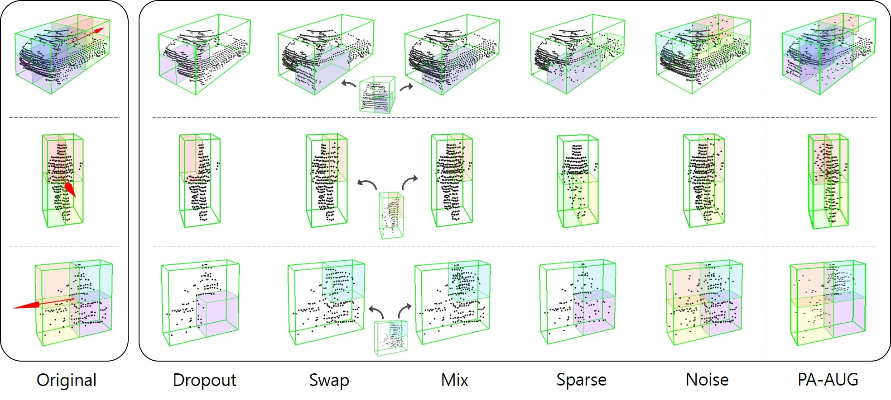

# Part-Aware Data Augmentation for 3D Object Detection in Point Cloud

This repository contains a reference implementation of our [Part-Aware Data Augmentation for 3D Object Detection in Point Cloud](https://ieeexplore.ieee.org/document/9635887) (IROS 2021).

<p align="center">
  
</p>


If you find this code useful in your research, please consider citing our work:
```
@inproceedings{choi2021part,
  title={Part-aware data augmentation for 3d object detection in point cloud},
  author={Choi, Jaeseok and Song, Yeji and Kwak, Nojun},
  booktitle={2021 IEEE/RSJ International Conference on Intelligent Robots and Systems (IROS)},
  pages={3391--3397},
  year={2021},
  organization={IEEE}
}
```
## Prerequisites
Our code was tested on [second.pytorch](https://github.com/traveller59/second.pytorch) and [OpenPCDet](https://github.com/open-mmlab/OpenPCDet).  
This repository contains only part-aware data augmentation code.  
Refer to the link above for code such as data loader or detector.

## Usage
```
Args:
    ** only supports KITTI format **
    points: lidar points (N, 4), 
    gt_boxes: ground truth boxes (B, 7),
    gt_names: ground truth classes (B, 1), 
    class_names: list of classes to augment (3),
    pa_aug_param: parameters for PA_AUG (string).

Returns:
    points: augmented lidar points (N', 4),
    gt_boxes_mask: mask for gt_boxes (B)


class_names = ['Car', 'Pedestrian', 'Cyclist']
pa_aug_param = "dropout_p02_swap_p02_mix_p02_sparse40_p01_noise10_p01"

pa_aug = PartAwareAugmentation(points, gt_boxes, gt_names, class_names=class_names)
points, gt_boxes_mask = pa_aug.augment(pa_aug_param=pa_aug_param)
gt_boxes = gt_boxes[gt_boxes_mask]
```

## Example
Follow [this repo](https://github.com/sky77764/PA-AUG-MD3D) if you want to check the implementation on OpenPCDet.
